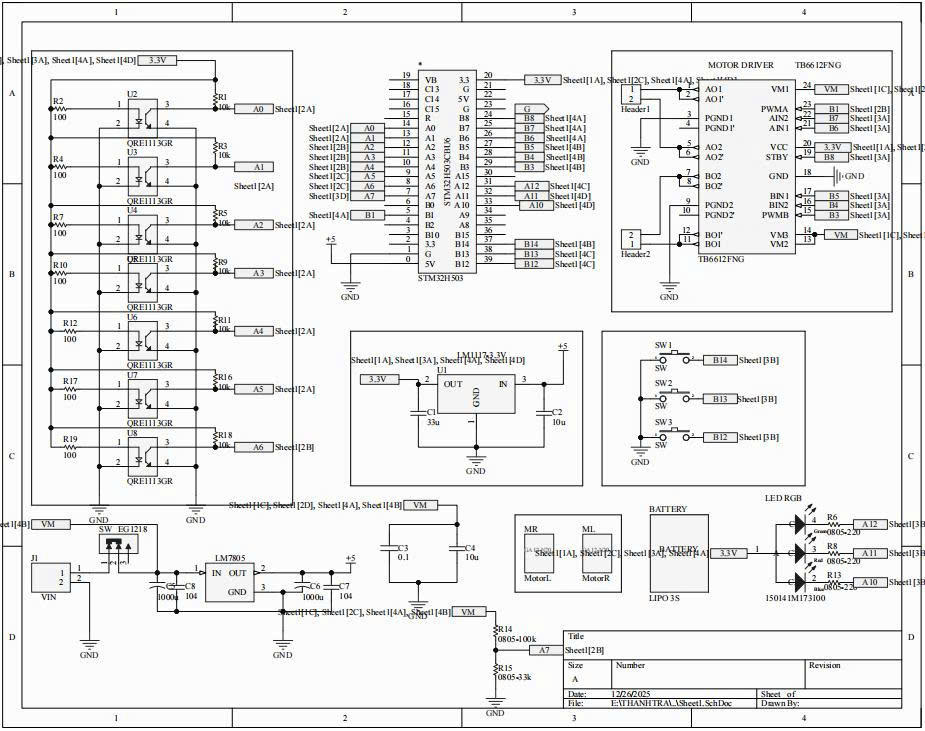
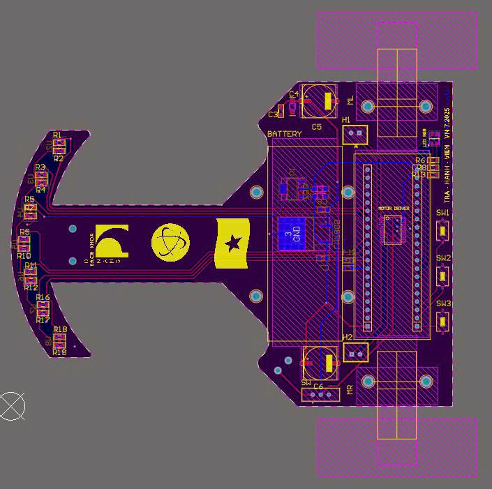
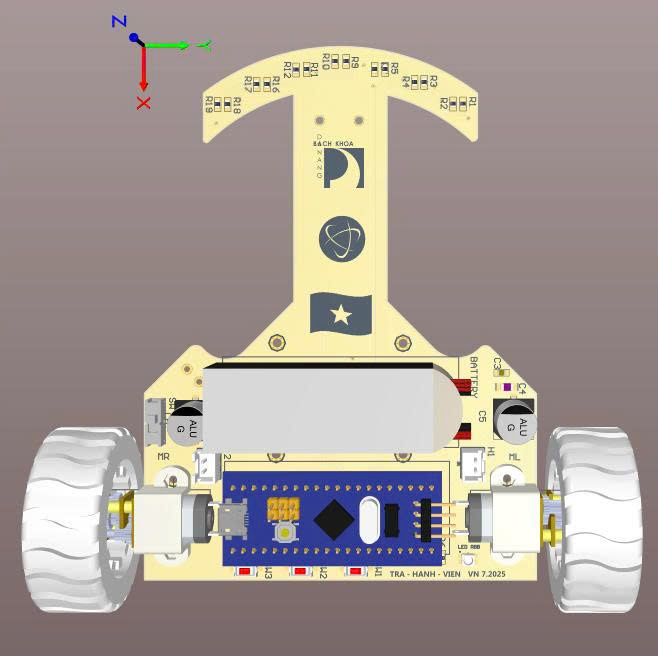

# Fast Line-Following Robot (International Competition – Taiwan)

## Overview
This project is a **high-speed autonomous line-following robot** designed and built for participation in an **international robotics competition in Taiwan**.  
The system focuses on **hardware reliability, precise motor control, and stable real-time performance**.

The robot uses **PID-based motor control** to achieve smooth and accurate line tracking, even on curved paths.

---

## Hardware Design
- Microcontroller: **STM32H503**
- Infrared line sensors for line detection
- Motor driver interface for DC motors
- Custom-designed **schematic and PCB** using **Altium Designer**
- On-board power regulation for MCU and motors

<p align="center">
  
  
  
</p>

---

## Firmware
- Developed in **Embedded C/C++**
- Bare-metal / low-level peripheral configuration
- **PID control algorithm** for motor speed and direction
- PWM-based motor control
- Tuned PID parameters for high-speed stability and smooth tracking

---

## Key Features
- Fully autonomous line-following operation
- PID-based motor control for smooth and accurate motion
- Designed for competitive performance and robustness
- Hardware and firmware developed from scratch

---

## Development Tools
- **Altium Designer** – Schematic & PCB design  
- **STM32CubeIDE** – Firmware development  
- **Git & GitHub** – Version control  

---

## Project Structure
```text
├── Firmware/ # STM32 firmware source code
├── Hardware/ # Schematic and PCB design files
└── README.md
```

---

## Author
**lethanhtra**  
Computer Engineering – Embedded Hardware & Firmware  
GitHub: https://github.com/thanhtra3105

---

## Notes
This project was developed independently, covering **hardware design, PCB layout, firmware development, and system debugging**.

